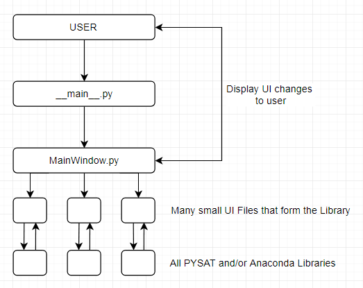

[](https://travis-ci.org/USGS-Astrogeology/PySAT_Point_Spectra_GUI) [](https://gitter.im/USGS-Astrogeology/PySAT?utm_source=badge&utm_medium=badge&utm_campaign=pr-badge&utm_content=badge)

# Easy Windows Installation

1. Download the [**setup**](https://drive.google.com/file/d/0B51OpD0tMItxc0NqTG84UlVZaGs/view?usp=sharing) file
2. Click and Install

# Installation with Miniconda

You can also copy and paste the code into your terminal

### Things you'll need

<a href="https://git-scm.com/downloads">git-bash </a><br>
<a href="https://conda.io/miniconda.html">Miniconda</a>

### 1. Fresh install of Miniconda (Skip to step 2 if you have Anaconda/Miniconda)

Install <a href="https://conda.io/miniconda.html">Miniconda</a>

### 2. Download necessary libraries

```bash
git clone --depth=50 --branch=master https://github.com/USGS-Astrogeology/PySAT_Point_Spectra_GUI.git
git clone --depth=50 --branch=master https://github.com/USGS-Astrogeology/PySAT.git
```

### 3. Python install libraries

```bash
cd PySAT
python setup.py install
cd ..
cd PySAT_Point_Spectra_GUI
python setup.py install
cd ..
```

### 4. Pip/Conda install necessary libraries

```bash
conda install pyqt
conda install numpy
conda install pandas
conda install scipy
pip install sklearn
conda install matplotlib
pip install qtmodern
```

### 5 Start the application

```bash
python PySAT_Point_Spectra_GUI\point_spectra_gui
```

if the application fails to start because of a missing dependency try `pip` or `conda` installing it.


# PYSAT UI
  

- The UI's backend is designed and created in Python with the QT framework
- The UI is being built to work closely with the original libraries

Current Road Ahead
- [x] Ported to version 5 of PyQt
- [x] Working Modules on UI
- [x] Selecting functions from Menubar adds functions dynamically
- [x] Shortcuts such as Ctrl S to save
- [ ] Embedded Plots and Graphs from data collected
- [x] ~~Package all python packages: sklearn, scipy, numpy, matplotlib, pysat for user consumption~~ It has been discovered that the user can download Anaconda, and run our files as normal.
- [x] Add ability to delete modules
- [x] Add ability to save plots in personal files
- [x] Add ability to save state of GUI, i.e. all number that user inputs will be there again after closing GUI
- [x] Add ability to save data frame at any point in the workflow 
- [ ] Setup a way to select points on a scatter plot.

## Control Flow



- The user begins by starting PYSAT_MAIN.
- PYSAT_MAIN will begin by loading the splash screen and all necessary UI pieces
- PYSAT_MAIN will then forward control to PYSAT_UI
- PYSAT_UI displays the mainframe in which the UI's submodules will be loaded into
- PYSAT_UI will then foward control to each submodule of focus
- Each submodule builds the collective UI library
- Each submodule fowards control to PYAT_FUNC which holds all the necessary logic functions
- These logic functions then forward commands to the various PYSAT and Anaconda libraries
- The values are then returned back up to PYSAT_FUNC which will then deal with changed data
